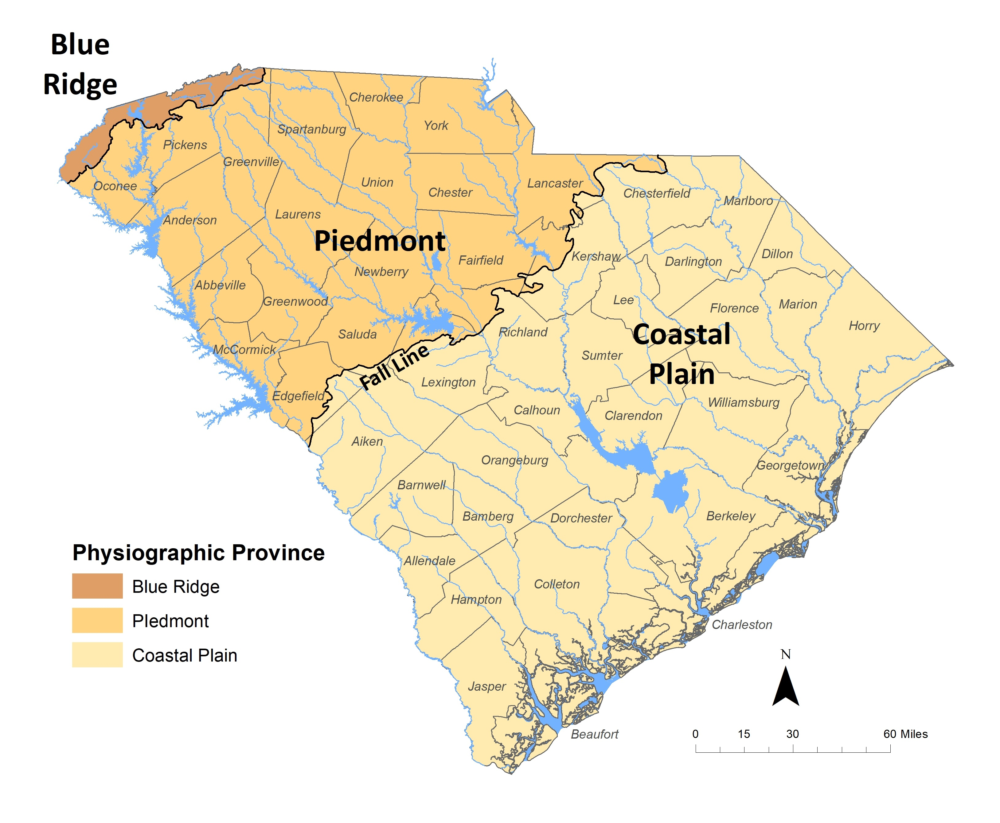

<!DOCTYPE html>
<html lang="en">

<head>

    <meta charset="utf-8">
    <meta name="viewport" content="width=device-width, initial-scale=1, shrink-to-fit=no">
    <meta name="description" content="South Carolina Department of Natural Resources - Geology Section information.">
    <meta name="author" content="South Carolina Department of Natural Resources - Geology Section">

    <title>Publications Map - SCDNR</title>
    
    <link rel="stylesheet" href="https://use.fontawesome.com/releases/v5.3.1/css/all.css" integrity="sha384-mzrmE5qonljUremFsqc01SB46JvROS7bZs3IO2EmfFsd15uHvIt+Y8vEf7N7fWAU" crossorigin="anonymous">

    <!-- Bootstrap core CSS -->
    <link href="css/bootstrap.min.css" rel="stylesheet">

    <!-- Custom styles for this template -->
    <link href="css/geol.css" rel="stylesheet">
	 <link rel="stylesheet" href="https://unpkg.com/leaflet@1.6.0/dist/leaflet.css" integrity="sha512-xwE/Az9zrjBIphAcBb3F6JVqxf46+CDLwfLMHloNu6KEQCAWi6HcDUbeOfBIptF7tcCzusKFjFw2yuvEpDL9wQ==" crossorigin=""/>
</head>

<body>

    <!-- Navigation -->
    <nav class="navbar navbar-expand-lg text-white fixed-top">
        

            
            <a class="navbar-brand ml-5 pl-5 pl-md-1" href="index.html">SCDNR Geological Survey</a>
            <button class="navbar-toggler navbar-dark" type="button" data-toggle="collapse" data-target="#navbarResponsive" aria-controls="navbarResponsive" aria-expanded="false" aria-label="Toggle navigation">
                
            </button>
            

                <ul class="navbar-nav ml-auto">
					<!--Data Dropdown-->
					<li class="nav-item dropdown">
                        <a class="nav-link dropdown-toggle" href="#" id="dropdownDataOne" data-toggle="dropdown" aria-haspopup="true" aria-expanded="false">About</a>
						

						<a class="dropdown-item" href="about.html">About Us</a>
						<a class="dropdown-item" href="programs.html">Programs</a>
						<a class="dropdown-item" href="core-repository.html">Core Repository</a>
						

                    </li>					
					<!--Data Dropdown-->
					<!--Data Dropdown-->
					<li class="nav-item dropdown">
                        <a class="nav-link dropdown-toggle" href="#" id="dropdownDataTwo" data-toggle="dropdown" aria-haspopup="true" aria-expanded="false">Earthquakes</a>
						

						<a class="dropdown-item" href="earthquakes.html">Overview</a>
						<a class="dropdown-item" href="recent-earthquakes.html">Recent Earthquakes</a>
						<a class="dropdown-item" href="earthquake-info.html">Earthquake Information</a>
						<a class="dropdown-item" href="earthquake-intensity.html">Earthquake Intensities</a>
						

                    </li>					
					<!--Data Dropdown-->
					<!--Data Dropdown-->
					<li class="nav-item dropdown">
						<a class="nav-link dropdown-toggle" href="#" id="dropdownDataThree" data-toggle="dropdown" aria-haspopup="true" aria-expanded="false">Education</a>
						

						<a class="dropdown-item" href="education.html">Education</a>
						<a class="dropdown-item" href="minerals.html">Minerals</a>
						<a class="dropdown-item" href="meteorites.html">Meteorites</a>
						<a class="dropdown-item" href="segsa.html">SEGSA Talks</a>
						

					</li>				
					<!--Data Dropdown-->
					<!--Data Dropdown-->
					<li class="nav-item dropdown">
                        <a class="nav-link dropdown-toggle" href="#" id="dropdownDataFour" data-toggle="dropdown" aria-haspopup="true" aria-expanded="false">Geology</a>
						

						<a class="dropdown-item" href="sc-geology.html">Overview</a>
						<a class="dropdown-item" href="https://scdnr.maps.arcgis.com/apps/Viewer/index.html?appid=735411a2f5714f28a424422296f77bb1">Geology of SC Application</a>
						<a class="dropdown-item" href="geologic-hazards.html">Geologic Hazards</a>
						<a class="dropdown-item" href="https://www.arcgis.com/apps/MapSeries/index.html?appid=8e44b2c5b05e499ab7d3ac86ee683b8e">Geological Society Field Trip</a>
						

                    </li>					
					<!--Data Dropdown-->					
					<!--Data Dropdown-->
					<li class="nav-item dropdown">
                        <a class="nav-link dropdown-toggle" href="#" id="dropdownDataFive" data-toggle="dropdown" aria-haspopup="true" aria-expanded="false">Publications & Data</a>
						

						<a class="dropdown-item" href="publications.html">Publications</a>
						<a class="dropdown-item" href="journals.html">Journals</a>
						<a class="dropdown-item" href="digital-data.html">Digital Data</a>
						

                    </li>					
					<!--Data Dropdown-->			
                </ul>
            

			
        

    </nav>

    <!-- Header with Background Image -->
    <header class="business-header">
        

            

                

                    <h1 class="page-header">Publications Map</h1>
                    
The map below was developed to help users searh for publications produced by the South Carolina Geological Survey by location.

                

            

        

    </header>

    <!-- Page Content -->
    

		
		

			

				

					<h2>Overview</h2>
						
Use your mouse to click a location in the state map below. A pop up including the quadrangle that your selected location is in as well as publications associated with that area will appear. For more information on the publications, search for them on the <a href="publications.html">publications page</a>.

						
Circulars, Field Trip Guidebooks, General Geologic Charts, the Mineral Resources Series, Minerals and Rocks, and Miscellaneous publications are not listed on this page. Search our <a href="publications.html">publications page</a> to find information on these types of publications.

				

				

					<h3 class="h4">Quick Links</h3>
						<ul>
							<li><a href="#statewide">Statewide and Coastal Plain Publications</a></li>
							<li><a href="publications.html">SCGS Publications</a></li>
							<li><a href="digital-data.html">Digital Data</a></li>
							<li><a href="publications.html#descriptions">Descriptions of Publication Types</a></li>
						</ul>
				

			

		

		
		

			

				

					

						

							

						

					

				

			

		

		
		

			

				
				

					<iframe width="500" height="400" frameborder="0" scrolling="no" marginheight="0" marginwidth="0" title="Geology Publications Map" src="//scdnr.maps.arcgis.com/apps/Embed/index.html?webmap=2086e8d9ba21431e9714efd80b6e9ed8&extent=-84.4474,31.8181,-76.334,35.5959&home=true&zoom=true&previewImage=false&scale=true&search=true&searchextent=true&disable_scroll=false&theme=light"></iframe>
				

			

		

		
					

					
				
					
					<iframe width="500" height="400" frameborder="0" scrolling="no" marginheight="0" marginwidth="0" title="South Carolina Geological Survey 24K Scale Geologic Map Coverage" src="//scdnr.maps.arcgis.com/apps/Embed/index.html?webmap=0e8a629708c646198e88d7880fe4c61f&extent=-86.8875,31.4308,-75.3959,36.131&zoom=true&previewImage=false&scale=true&search=true&searchextent=false&legend=true&disable_scroll=true&theme=light"></iframe>
				

			
 
		
		

			<h2 id="statewide">Statewide and Coastal Plain Publications</h2>
			

				

					<h3 class="h5">Statewide Publications</h3>
					<ul>
						<li>GGMS-1</li>
						<li>GGMS-3</li>
						<li>GGMS-4</li>
						<li>MS-21</li>
						<li>OFR-14</li>
						<li>OFR-34A</li>
						<li>OFR-49</li>
						<li>OFR-50</li>
						<li>OFR-61</li>
						<li>OFR-108</li>
						<li>OFR-111</li>
						<li>OFR-125</li>
					</ul>
				

				

					<h3 class="h5">Coastal Plain Publications</h3>
					<ul>
						<li>GGMS-2</li>
						<li>GGMS-5</li>
						<li>GGMS-6</li>
						<li>MS-15 (Lower Coastal Plain)</li>
					</ul>
				

				

					
				

			

		

	

    <!-- /.container -->
    <!-- Footer -->
    <footer class="py-5 ">
        

            

                
     	
				
<strong>Links</strong> 
					<a href="earthquakes.html">Earthquakes in South Carolina</a>
					 <a href="https://earthquake.usgs.gov/ens/">Earthquake Notification Service</a>
					 <a href="education.html#rockandmineral">Rocks and Minerals Kit</a>
					 <a href="meteorites.html">Meteorites</a>
					 <a href="photo-gallery.html">Photo Galleries</a>
					 <a href="minerals.html">Mineral Resources</a>
					 <a href="SCO2/index.html">Carbon Sequestration</a>
					 <a href="segsa.html">SEGSA Presentations</a>
					 <a href="http://hydrology.dnr.sc.gov/index.html">Hydrology Section</a>				
					 <a href="http://hydrology.dnr.sc.gov/water-planning.html">South Carolina Water Plan</a>
					 <a href="http://www.dnr.sc.gov/water/flood/index.html">Flood Mitigation Program</a>
					 <a href="geology-news.html">Archived Survey News</a>
					 <a href="links.html">Helpful Links</a>

                

				
                
                    
South Carolina Geological Survey 
                        5 Geology Road 
                        Columbia, SC 29212 
                        <a href="index.html">dnr.sc.gov/geology/index.html</a>
                    

                    
                    
Copyright © 
                        
                    

                

            
            

            
        
        
    </footer>
    <!-- Bootstrap core JavaScript -->
    
      
	
	<!--Leaflet JavaScript-->
    
    
    
    
    

    
	

    
  </body>

</html>
